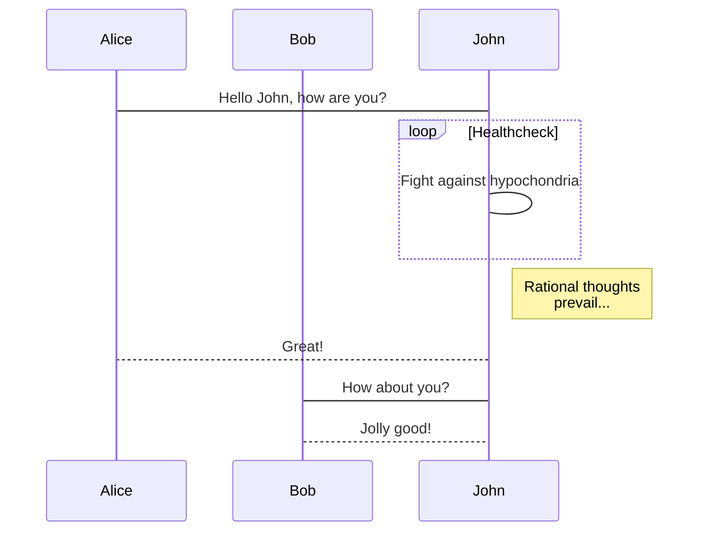
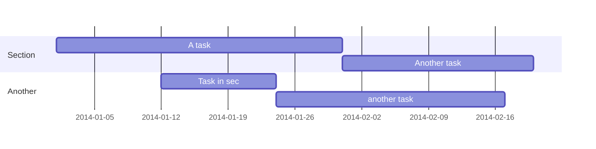

# this is H1
## this is H2
### this is H3
#### this is H4
##### this is H5
###### this is H6

**这是加粗**
__这也是加粗__
*这是倾斜*
_这也是倾斜_
***这是加粗倾斜***
~~two tildes~~

### 分割线
* * *
***
**********
- - -
_________________

> 这是引用
> 这也是是引用

# 这是反斜杠
\> \* \_ \- 

> This is the first level of quoting.
>
> > This is nested blockquote.
>
> > > > Back to the first level.

- 列表内容
+ 列表内容
* 列表内容

1. 列表内容
2. 列表内容
3. 列表内容

* 一级无序列表内容
   * 二级无序列表内容
   * 二级无序列表内容
   * 二级无序列表内容

*   况吾与子渔樵于江渚之上，侣鱼虾而友麋鹿，驾一叶之扁舟，举匏樽以相属。寄蜉蝣于天地，渺沧海之一粟。
    哀吾生之须臾，羡长江之无穷。挟飞仙以遨游，抱明月而长终。知不可乎骤得，托遗响于悲风。
*   逝者如斯，而未尝往也；盈虚者如彼，而卒莫消长也。盖将自其变者而观之，则天地曾不能以一瞬；
    自其不变者而观之，则物与我皆无尽也，而又何羡乎!且夫天地之间，物各有主,苟非吾之所有，虽一毫而莫取。
    惟江上之清风，与山间之明月，耳得之而为声，目遇之而成色，取之无禁，用之不竭，是造物者之无尽藏也，而吾与子之所共适。


[百度](http://baidu.com)

表头|表头|表头
---|:--:|---:
内容|内容|内容
内容|内容|内容

这是 高亮.

  `代码内容`

(```)
  代码...
  代码...
  代码...
(```)

1. First item
   1. A sub-item
2. Another item

- First item
  - A sub-item
- Another item

- [x] Write math example
  - [x] Write diagram example
- [ ] Do something else

I have more [^1] to say.

[^1]: Footnote example.

gallery_item:
- album: <ALBUM FOLDER>
  image: <IMAGE 1 NAME>.jpg
  caption: Write your image 1 caption here
- album: <ALBUM FOLDER>
  image: <IMAGE 2 NAME>.jpg
  caption: Write your image 2 caption here






```python
# Example of code highlighting
input_string_var = input("Enter some data: ")
print("You entered: {}".format(input_string_var))
```
$$\gamma_{n} = \frac{ 
\left | \left (\mathbf x_{n} - \mathbf x_{n-1} \right )^T 
\left [\nabla F (\mathbf x_{n}) - \nabla F (\mathbf x_{n-1}) \right ] \right |}
{\left \|\nabla F(\mathbf{x}_{n}) - \nabla F(\mathbf{x}_{n-1}) \right \|^2}$$

$$f(k;p_{0}^{*}) = \begin{cases}p_{0}^{*} & \text{if }k=1, \\\\
1-p_{0}^{*} & \text{if }k=0.\end{cases}$$

{}
A Markdown callout is useful for displaying notices, hints, or definitions to your readers.
{}

{}
Here's some important information...
{}



I : heart : Wowchemy : smile :

 Terminal  
 Python  
 R






You found me!


{}Download my CV{}
 


